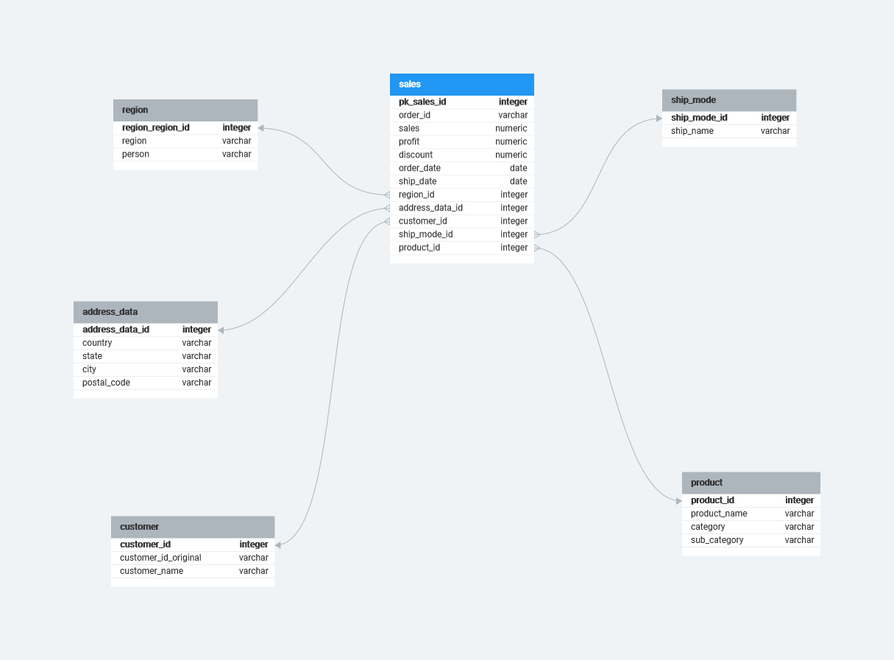

# Задание для модуля 2

## 2.2 Установка БД
Установил базу данных Postgres на windows 10.
## 2.3 Подключение к Базам Данных и SQL
1. Для работы с Postgres использовался pgAdmin 4.
2. Для создания таблиц и загрузки данных использовались следующие скрипты:
   -  [create_orders.sql](2.3/create_orders.sql)
   -  [create_people.sql](2.3/create_people.sql)
   -  [create_returns.sql](2.3/create_returns.sql)
3. Запросы к БД для ответов на вопросы из 1 модуля в файле [requests.sql](2.3/requests.sql)

## 2.4 Модели Данных
1. Создал физическую модель данных в [DB Designer](https://erd.dbdesigner.net/), получилось такое: 
  
2. Создал таблицы следующим скриптом:
   [create_tables.sql](2.4/create_table.sql)
3. Прежде чем заполнять новые таблицы из ресурсного слоя перезалил данные в orders, но уже с заполнением пропусков в postal_code и прямо из csv файла, такой командой: 
`\copy orders FROM 'C:\Users\budni\Desktop\table_sales_1.csv' DELIMITER ';' CSV HEADER ENCODING 'windows-1251';`
Далее загрузил данные, используя следующий скрипт:
[load_data_in_table.sql](2.4/load_data_in_table.sql)
Там же есть скрипты для загрузки новых данных в уже существующие и заполненные таблицы справочники. 

2.5 База данных в облаке
- создал учетную запись в yandex cloud (дают грант);
- создал БД PostgreSQL на машине с такими характеристиками: 2 vCPU, 100% vCPU rate, 4 ГБ RAM, 10 GB hdd;
- подключился в БД через DBeaver;
- создал таблицы и загрузил данные по таким скриптам: 
    - [create_resourse_table.sql](2.5/create_resourse_table.sql);
    - [create_table.sql](2.5/create_table.sql);
    - [load_data_from_resourse_layer.sql](2.5/load_data_from_resourse_layer.sql);
    - [request.sql](2.5/request.sql).
  и также использовал `\copy orders FROM 'C:\Users\budni\Desktop\table_sales_1.csv' DELIMITER ';' CSV HEADER ENCODING 'windows-1251';`
- ответил на вопросы из 1 модуля таким скриптом: [request.sql](2.5/request.sql).

2.6: Как донести данные до бизнес-пользователя

В DataLens создал такой дашборд:
